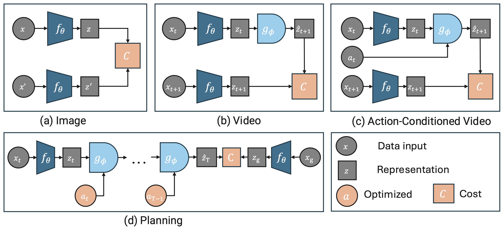

# Energy Based Joint Embedding Predictive Architectures



An open source library and tutorial for learning representations for prediction and planning using joint embedding predictive architectures.

> Each example is (almost) self-contained and training takes up to a few hours on a single GPU card.

---

## 📚 Examples

### [Image JEPA](examples/image_jepa/README.md)

Self-supervised representations from unlabeled images on CIFAR-10, evaluated on classification.


### [Video JEPA](examples/video_jepa/README.md)

Predict next image representation in a sequence.


### [AC Video JEPA](examples/ac_video_jepa/README.md)

JEPA for world modeling + planning in Two Rooms environment.

| Planning Episode | Task Definition |
|------------------|-----------------|
|  |  |
| *Successful planning episode* | *From init to goal state* |

---

## 🚀 Installation

We use [uv](https://docs.astral.sh/uv/guides/projects/) for package management.

```bash
# Install dependencies
uv sync
# Option 1: Activate virtual environment
source .venv/bin/activate
python main.py
# Option 2: Run directly with uv
uv run python main.py
```
If you need conda-specific packages, you can use **Conda + uv**

```bash
# Create conda environment with Python 3.12
conda create -n eb_jepa python=3.12 -y
conda activate eb_jepa
# Install package in editable mode with dev dependencies (pytest, black, isort)
uv pip install -e . --group dev
```

Add these to your `~/.bashrc` for persistent configuration.

```bash
# Required for SLURM jobs to find datasets
export EBJEPA_DSETS=/path/to/eb_jepa/datasets
# Optional: Directory for checkpoints and logs
export EBJEPA_CKPTS=/path/to/checkpoints
```


---

## 🏋️ Training

### Quick Start

```bash
# Local training
python -m examples.{image_jepa,video_jepa,ac_video_jepa}.main
```
> Our default configs are tuned for H100 GPUs. With older GPUs (e.g., A100, V100), you may need to reduce batch size to fit in memory.

### 📂 Folder Structure

All experiments use a unified folder structure:

```
checkpoints/
└── {example_name}/
    ├── dev_2026-01-16_00-10/                 # Single/local runs (dev_ prefix)
    │   └── {exp_name}_seed1/
    │
    ├── sweep_2026-01-16_00-10/         # Auto-named 3-seed sweep
    │   ├── {exp_name}_seed1/
    │   ├── {exp_name}_seed1000/
    │   └── {exp_name}_seed10000/
    │
    └── sweep_my_experiment/            # Custom-named sweep
        └── ...
```

`{exp_name}` encodes key hyperparameters to avoid folder collisions, e.g.:
- **image_jepa**: `resnet_vicreg_proj_bs256_ep300_ph2048_po2048_std1.0_cov80.0`
- **video_jepa**: `resnet_bs64_lr0.001_std10.0_cov100.0`
- **ac_video_jepa**: `impala_cov8_std16_simt12_idm1`

<details>
<summary><span style="font-size: 1.17em; font-weight: bold;">🖥️ SLURM Launcher (optional)</span></summary>

| Command | Description |
|---------|-------------|
| `--example {name}` | Choose: `image_jepa`, `video_jepa`, `ac_video_jepa` |
| `--fname {path}` | Run the sweep specified in the config at `{path}` |
| `--single` | Launch single job (dev mode) |
| `--sweep {name}` | Custom sweep name |
| `--array-parallelism {N}` | Limits the maximum number of concurrent jobs to `N` |
| `--full-sweep` | Full hyperparameter sweep from config |
| `--use-wandb-sweep` | Enable wandb sweep UI |

```bash
# 3 seeds with wandb averaging (recommended)
python -m examples.launch_sbatch --example image_jepa --fname examples/image_jepa/cfgs/default.yaml

# Custom sweep name
python -m examples.launch_sbatch --example image_jepa --fname examples/image_jepa/cfgs/default.yaml --sweep my_experiment

# Single job
python -m examples.launch_sbatch --example image_jepa --fname examples/image_jepa/cfgs/default.yaml --single

# Full hyperparameter sweep
python -m examples.launch_sbatch --example image_jepa --fname examples/image_jepa/cfgs/default.yaml --full-sweep

# With wandb sweep UI for hyperparameter analysis
python -m examples.launch_sbatch --example image_jepa --fname examples/image_jepa/cfgs/default.yaml --use-wandb-sweep
```

Replace `image_jepa` with `ac_video_jepa` or `video_jepa` for other examples.

**Full Sweep Configuration:** The `--full-sweep` flag reads the `sweep.param_grid` section from the example's YAML config file (e.g., `examples/image_jepa/cfgs/default.yaml`). Without this flag, only a 3-seed sweep is launched. To customize sweep parameters, edit the `sweep` section in the config:

```yaml
# Example: examples/image_jepa/cfgs/default.yaml
sweep:
  param_grid:
    loss.cov_coeff: [0.1, 1.0, 10.0, 100.0]
    loss.std_coeff: [1.0, 10.0]
    meta.seed: [1, 1000, 10000]
```

### Wandb Seed Averaging

Runs with the same hyperparameters but different seeds share the same wandb run name, enabling automatic averaging:

1. Go to wandb web UI → Runs table
2. Click **"Group by"** → select **"Name"**
   → Groups runs with identical hyperparameters (different seeds) together

To filter runs from a specific sweep:
3. Click **"Filter"** → **"Group"** → select your sweep name

For detailed wandb sweep analysis (parallel coordinates, hyperparameter importance):
1. Use `--use-wandb-sweep` flag when launching
2. Go to wandb web UI → left pane → **"Sweeps"** → click your sweep name

**SLURM Configuration:** To customize SLURM parameters (partition, account, memory, etc.), edit the `SLURM_DEFAULTS` dictionary at the top of `examples/launch_sbatch.py`.

</details>

## 🧪 Running test cases

Libraries added to eb_jepa [must have their own test cases](/tests/). To run the tests:

```bash
# With uv sync installation
uv run pytest tests/
# With conda + uv installation (no .venv created)
pytest tests/
```

## 👩‍💻 Development

- The dev dependencies include `black` and `isort`, which must be run before contributing to this repo.

## 📄 License

EB-JEPA is Apache licensed. See [LICENSE](LICENSE.md).
