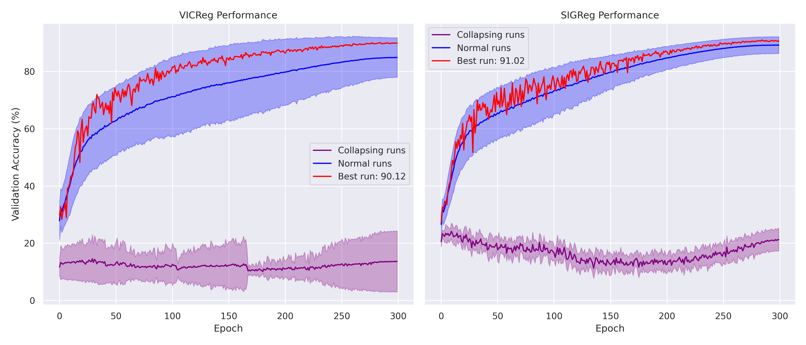

## Self-Supervised Representation Learning from Unlabeled Images

This example demonstrates how to train a Joint Embedding Predictive Architecture (JEPA) on unlabeled images. More precisely, methods studied here are JEAs as there is no predictor. The model learns representations from individual frames of the CIFAR 10 dataset and is evaluated using linear probing for image classification.


## Features

- **Image-only training**: Training from unlabeled image data
- **Representation learning**: Learns meaningful representations through self-supervised learning, by learning to be invariant to image augmentations (crop, color augmentations, etc).
- **Linear probing evaluation**: Evaluates learned representations using a linear classifier. This is evaluated online, during training on a validation set.


## Architecture

The Image JEPA consists of:
- **Encoder**: ResNet18/Transformer backbone that processes individual images
- **Regularizer**: Variance-Covariance (VC) or SIGReg loss to prevent representation collapse
- **Projector**: Learned MLP Projector (loss is computed on the projected subspace)

## Usage

### Training Configurations

#### 1. ResNet + VICReg Loss

```bash
python -m examples.image_jepa.main --fname examples/image_jepa/cfgs/default.yaml
```

#### 2. ResNet + SIGReg (SIGReg) Loss

```bash
python -m examples.image_jepa.main --fname examples/image_jepa/cfgs/sigreg.yaml
```

#### 3. Vision Transformer + VICReg Loss

```bash
python -m examples.image_jepa.main --fname examples/image_jepa/cfgs/transformers.yaml
```

For ViT-Base, add `model.type=vit_b` override:

```bash
python -m examples.image_jepa.main --fname examples/image_jepa/cfgs/transformers.yaml model.type=vit_b
```

#### Custom Overrides

You can override any config parameter using dot notation:

```bash
python -m examples.image_jepa.main --fname examples/image_jepa/cfgs/default.yaml optim.epochs=50 data.batch_size=128
```

## Results

### Comparison: SIGReg and VICReg

We first compare the sensitivity to regularizer loss coefficients of SIGReg and VICReg. We sweep over these, training on CIFAR-10 with ResNet-18 backbone, trained for 300 epochs.



| Metric | SIGReg (BCS) | VICReg |
|--------|------------------|--------|
| Best Accuracy | 91.02% | 90.12% |
| Average (non-collapsed) Accuracy | 89.22% | 84.90% |
| Projector Benefit | +3.3 points | +2.9 points |
| Hyperparameters | 1 | 2 |
| Best Projector Dims | 2048×128 | 2048x1024 |

**Finding:** Both methods achieve similar peak performance (~90%). While both methods can fail in certain cases, logical hyperparameter choices give performance in a similar ballpark. Performing the most naïve search over hyperparameters, SIGReg can be easier to tune due to the use of a single loss hyperparameter.

### Impact of regularizations

With a batch size of 256 and 1024x1024 projector we investigate the impact of regularizations for VICReg and SIGReg:

|      | SIGReg    |          | VICReg     |          |
|------|------------|----------|------------|----------|
| Rank | Hyperparameters | Accuracy | Hyperparameters | Accuracy |
| 1 | $\lambda$= 10 |90.88 %   | std = 1 cov = 100 | 90.12 % |
| 2 | $\lambda$= 1 | 86.94%    | std = 1 cov = 10 | 89.93 % |
| 3 | $\lambda$= 100 | 80.86%  | std = 10 cov = 10 |  89.2 % |
| -1 | $\lambda$= 0.1 | 27.20% | std = 100 cov = 100 | 10.00% |

**Finding:** For both methods, performance can vary drastically between different hyperparameter choices. The main failure mode is when losses such as the invariance term (here set with a weight of 1) become insignificant which leads to a fundamentally flawed training. Logical choices offer much more stable performance.


### Impact of the projector

Top 5 dimension combinations. For SIGReg we use λ=10.0, batch_size=256 and for VICReg std=1.0,cov=100, batch_size=256:

|      | SIGReg    |          | VICReg     |          |
|------|------------|----------|------------|----------|
| Rank | Dimensions | Accuracy | Dimensions | Accuracy |
| 1 | 2048 × 128 | 91.02% | 2048 × 1024 | 90.12% |
| 2 | 4096 × 1024 | 91.00% | 4096 x 512 | 90.10% |
| 3 | 2048 × 64 | 90.99% | 1024 x 1024 | 90.05% |
| 4 | 512 × 256 | 90.99% | 2048 x 512 | 90.03% |
| 5 | 4096 × 64 | 90.96% | 4096 x 1024 | 90.02% |
| N/A | None | 87.75% | None | 87.27% |

**Finding:** Large hidden dimensions are beneficial for both methods, although all of the top-performing scenarios all offer similar performance.
VICReg tends to work better with higher dimensional output dimensions, whereas SIGReg works better with small output dimensions.
This difference does not lead to meaningful practical differences in terms of training time or memory.

Both methods have a similar drop of performance of around 2.5-3 points when not using a projector, highlighting its importance in the method's design.


---


## References
- [JEPA Paper](https://openreview.net/pdf?id=BZ5a1r-kVsf)
- [ResNet Architecture](https://arxiv.org/abs/1512.03385)
- [Transformer Architecture](https://arxiv.org/abs/1706.03762)
- [Vision Transformer Architecture](https://arxiv.org/abs/2010.11929)
- [VICReg](https://arxiv.org/abs/2105.04906)
- [LeJEPA/SIGReg](https://arxiv.org/abs/2511.08544)
