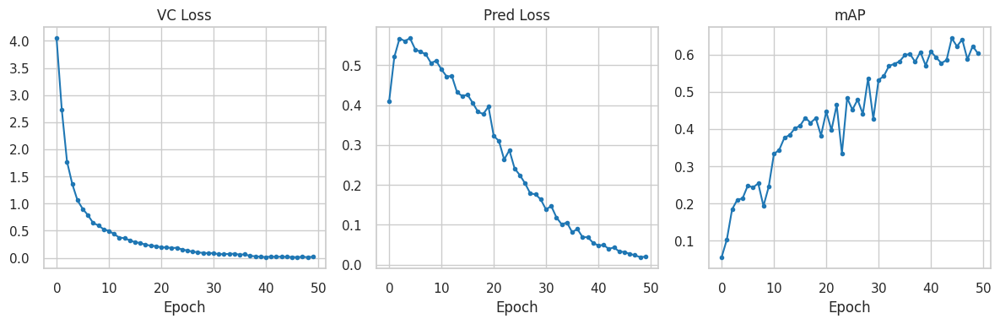
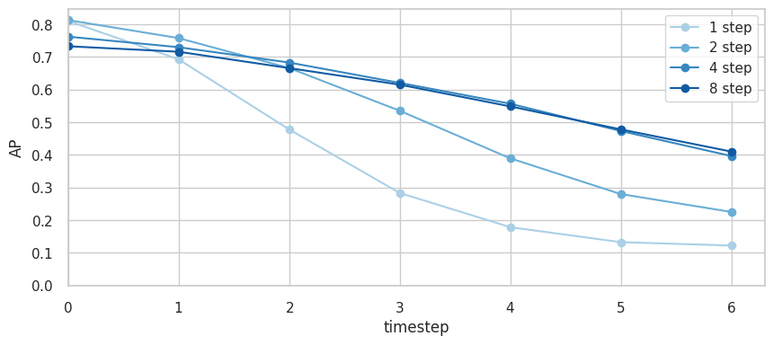

# Self-Supervised Representation Learning from Video Sequences

This example demonstrates Joint Embedding Predictive Architecture (JEPA) for self-supervised representation learning on moving MNIST video sequences. The videos show two hand-written digits (0-9) moving around the video frame and bouncing off the edges using standard collision physics. The JEPA is trained to predict future video representations from past observations without requiring labeled data, effectively predicting the future trajectory of the digits, in representation space.


### Overview
The video JEPA architecture consists of:
- **Encoder (`ResNet5`)**: A lightweight ResNet that maps video frames to latent representations. Uses residual blocks for stable gradient flow.
- **Predictor (`ResUNet`)**: A UNet-based architecture that predicts future representations given concatenated current and previous representations. Skip connections preserve spatial information.
- **Projector (`MLP`)**: A simple network that projects representations before applying a cost function.

### Training
Training works as follows. First, video frames are encoded into representation space. Then the past `K` frame encodings are taken as context and provided to the predictor. The predictor predicts the `K+1` th frame representation. Both the encoder and predictor are trained together with the following objectives:

- **Prediction Loss**: Minimizes prediction error between predicted and actual future representations. The prediction loss supports multi-step rollout prediction to predict `T` steps into the future autoregressively, ensuring temporal consistency of predictions.
- **VC Loss (Variance-Covariance)**: Regularizes representations to prevent collapse. The VC loss is parametrized by two weight factors `std_coeff` and `cov_coeff` for the variance and covariance terms respectively.

### Evaluation
We evaluate the trained JEPA models using a simple digit detection task. Specifically, we train a frame-level decoder to predict the discretized location of a digit, given its encoder representations (BCE loss). We then use the JEPA to generate the future video representations autoregressively, and predict and evaluate the digit locations using the decoder. We also train a pixel-level decoder for the JEPA representations for visualization purposes (MSE loss). Note that both decoders are trained independent to the JEPA training (i.e., gradients are detached).

We report average precision for digit locations at `T` timesteps into the future (`AP_T`) as well as the average over all prediction horizons (`mAP`).

## Setup

The example uses Moving MNIST, a synthetic dataset with multiple digits moving across the screen, motion follows simple physics (bouncing off boundaries). **Note**: The Moving MNIST dataset (~800MB) is automatically downloaded on first run from the University of Toronto servers. This requires internet access. If you're running on a cluster without internet access, you can manually download the dataset:
```bash
wget https://www.cs.toronto.edu/~nitish/unsupervised_video/mnist_test_seq.npy -P datasets/
```


## Training

Train a model with the default configuration (`cov_coeff=100, std_coeff=10, nsteps=4`):
```bash
python -m examples.video_jepa.main \
   --fname examples/video_jepa/cfgs/default.yaml
```

You can override any config parameter using dot notation:
```bash
python -m examples.video_jepa.main \
   --fname examples/video_jepa/cfgs/default.yaml \
   model.steps=2 \
   data.batch_size=128
```

This will train all components and decoders and visualize results in wandb.

**Key parameters**
- `model.dobs`: Input observation dimensions
- `model.henc`: Hidden dimensions in encoder
- `model.hpre`: Hidden dimensions in predictor
- `model.dstc`: Output representation dimensions
- `model.steps`: Number of prediction steps during training
- `loss.cov_coeff`: Variance-covariance loss coefficient
- `loss.std_coeff`: Standard deviation loss coefficient

## Results


Visualization from wandb showing input frames, full rollout obtained via auto-regressive prediction and predicted digit detections (blue heatmap overlays) on Moving MNIST data. The JEPA model learns representations that can predict dynamics well.

### Detection accuracy
We plot the JEPA training losses and detection performance (`mAP`) to show how they evolve to learn stronger representations over time.


### Multi-step Prediction

The `model.steps` parameter controls how many future prediction steps are used to calculate the loss, which has a direct impact on how far into the future the JEPA model can reliably predict.



As expected, predicting the very next timestep is easy (high mAP) while performance further into the future is naturally lower. Recursively predicting more steps achieve significantly better mAP compared to 1-step or 2-step predictions, however this saturates by 8 steps, which approaches the duration of the video (training is done with 10 frame horizon).

### JEPA loss ablation

We vary the `cov_coeff` and `std_coeff` to see the effect on downstream performance (`mAP`). We find the best configuration to be `cov_coeff=100`, `std_coeff=10`.

|   cov ↓ std → |        1 |       10 |      100 |
|------------|---------:|---------:|---------:|
|           1 | 0.259 | 0.450 | 0.492 |
|          10 | 0.448 | 0.424 | 0.487 |
|         100 | 0.516 | **0.607** | 0.525 |


## References

- [JEPA Paper](https://openreview.net/pdf?id=BZ5a1r-kVsf)
- [Moving MNIST Dataset](https://github.com/edenton/svg)
- [ResNet Architecture](https://arxiv.org/abs/1512.03385)
- [UNet Architecture](https://arxiv.org/abs/1505.04597)
- [VC Loss](https://arxiv.org/abs/2105.04906)
